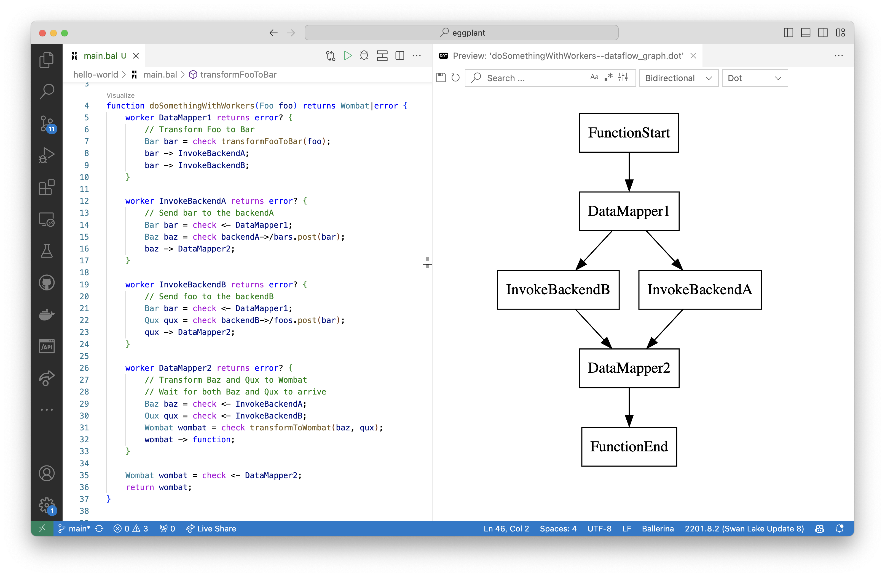

# Eggplant

Eggplant is a codename for a low-code integration platform that uses Ballerina underneath.

## Low-code integration tools 
- Low-code integration tools are designed with user accessibility in mind, offering graphical interfaces that allow for intuitive design and deployment of complex processes without deep technical expertise.
- They abstract the complexities of coding by allowing users to build workflows visually, similar to assembling a puzzle, where each piece represents a functional component in a dataflow model.
- Low-code platforms provides pre-built components that represent common integration tasks which can be easily configured and reused across different projects.

## Dataflow model
- The dataflow model naturally lends itself to visual representation, where each operation or transformation on the data is a node in a graph, and the movement of data between these operations is represented by edges.
- Nodes in a dataflow model are like checkpoints or processing stations, which can have multiple sources (inputs) and multiple destinations (outputs).
- Each node independently acts upon the data it receives, upon which the processed data flows to the next node(s) in the pipeline.
- This model is inherently parallel, allowing different nodes to operate simultaneously, leading to efficient data processing and scalable system design.

## Ballerina workers
- Workers in Ballerina are lightweight concurrent executors that can be used to manage multiple units of execution within a single service or function.

```ballerina
function doSomethingWithWorkers(Foo foo) returns Wombat|error {
    worker DataMapper1 returns error? {
        // Transform Foo to Bar
        Bar bar = check transformFooToBar(foo);
        bar -> InvokeBackendA;
        bar -> InvokeBackendB;
    }

    worker InvokeBackendA returns error? {
        // Send bar to the backendA
        Bar bar = check <- DataMapper1;
        Baz baz = check backendA->/bars.post(bar);
        baz -> DataMapper2;
    }

    worker InvokeBackendB returns error? {
        // Send foo to the backendB
        Bar bar = check <- DataMapper1;
        Qux qux = check backendB->/foos.post(bar);
        qux -> DataMapper2;
    }

    worker DataMapper2 returns error? {
        // Transform Baz and Qux to Wombat
        // Wait for both Baz and Qux to arrive
        Baz baz = check <- InvokeBackendA;
        Qux qux = check <- InvokeBackendB;
        Wombat wombat = check transformToWombat(baz, qux);
        wombat -> function;
    }

    Wombat wombat = check <- DataMapper2;
    return wombat;
}
```
- The body of a worker can contain any code, just like a regular function. Workers can be thought of as functions that execute concurrently.
- Workers communicate with each other using message passing. 
- Workers communicate via messages, and importantly, each communication channel is 'typed,' meaning it is defined to carry a specific kind of data.
- Workers respect transactional boundaries set in Ballerina, which means they can participate in transactions and ensure atomicity of operations when used in conjunction with Ballerina's transaction support.

## Ballerina workers as dataflow nodes
- Ballerina workers can be conceptualized as nodes within a dataflow model, where each worker represents a node.
- Similar to dataflow nodes, Ballerina workers can handle 'n' number of inputs and outputs, allowing for rich interaction patterns between different workers/nodes.
- The typed nature of worker communication ensures that data flows through the system with integrity, with each worker/node expecting and producing data in a defined format.
- By representing each node with a Ballerina worker, we can visualize complex integration workflows as a directed graph of workers, simplifying the understanding and management of the system.

The following diagram is a visual representation of the Ballerina code snippet above, where each worker is represented as a node in the graph, and the edges represent the flow of data between the workers.



## Samples 

- [Message Transformation](./message-transformation/README.md)
- [Content based message routing](./content-based-message-routing/README.md)
- [Clone and aggregate messages](./clone-aggregate/README.md)
- [Service orchestration](./service-orchestration/README.md)
