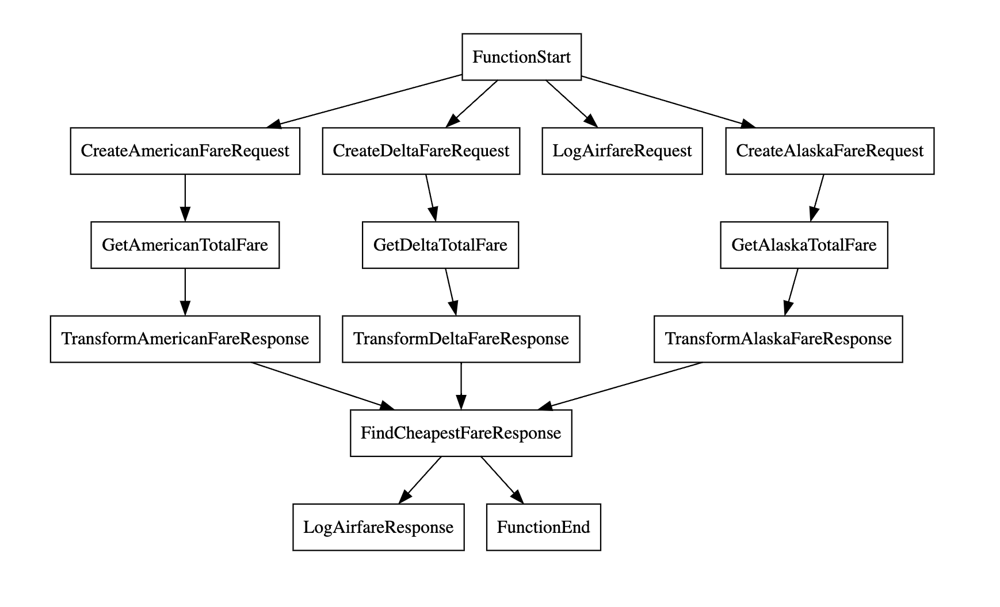
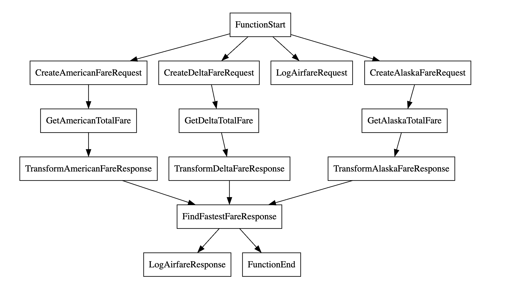

## Clone and aggregate 
This sample contains two resources that are used to demonstrate the clone and aggregate capability.
- Make three calls to Delta, American, Alaska and return the cheapest response. 
- Make three calls to Delta, American, Alaska and return the fastest response. 

## Simple visualization of the integration

### Cheapest airfare


### Fastest response


## Steps to run the sample

### 1) Start the HTTP service

```bash
cd <repo-root-dir>/clone-aggregate
bal run
```

### 2) Send a request
```sh
curl -v -X POST --data @request.json http://localhost:9091/abcflights/airfare/cheapest --header "Content-Type:application/json"
```

### 3) Verify the response
```json
{
  "sourceCode": "LAX",
  "destCode": "ORD",
  "passengers": 2,
  "totalFare": 5107.39,
  "airline": "Alaska"
}
```