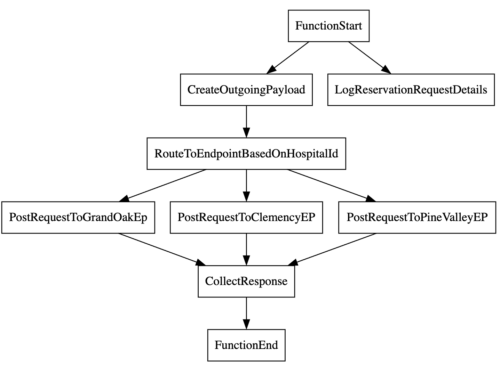

## Content based message routing
This sample is based on the following integration tutorial in [ballerina.io](https://ballerina.io).

[https://ballerina.io/learn/integration-tutorials/content-based-message-routing/#complete-source-code](https://ballerina.io/learn/integration-tutorials/content-based-message-routing/#complete-source-code)

## Simple visualization of the integration



## Steps to run the sample

### 1) Start backend services

```bash
cd <repo-root-dir>/backends
bal run hospitalservice.jar
```

### 2) Start the HTTP service

```bash
cd <repo-root-dir>/content-based-message-routing
bal run
```

### 3) Send a request
```sh
curl -v -X POST --data @request.json http://localhost:8290/healthcare/categories/surgery/reserve --header "Content-Type:application/json"
```

### 4) Verify the response
```json
{
    "appointmentNumber": 8,
    "doctor": {
        "name": "thomas collins",
        "hospital": "grand oak community hospital",
        "category": "surgery",
        "availability": "9.00 a.m - 11.00 a.m",
        "fee": 7000.0
    },
    "patient": {
        "name": "John Doe",
        "dob": "1940-03-19",
        "ssn": "234-23-525",
        "address": "California",
        "phone": "8770586755",
        "email": "johndoe@gmail.com"
    },
    "fee": 7000.0,
    "hospital": "grand oak community hospital",
    "confirmed": false,
    "appointmentDate": "2017-04-02"
}
```