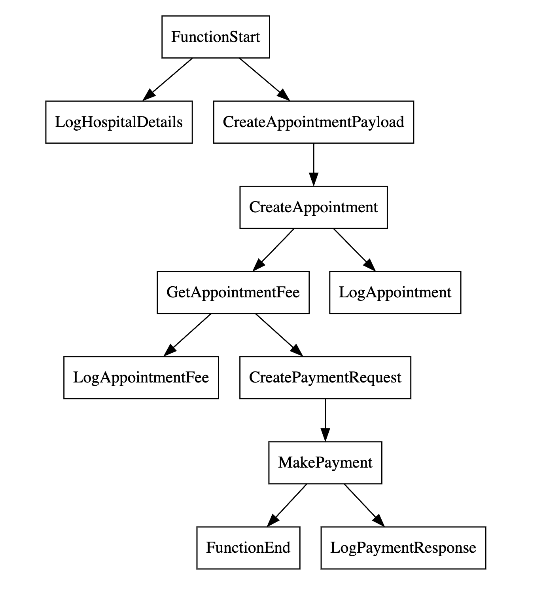

## Service orchestration
This sample is based on the following integration tutorial in [ballerina.io](https://ballerina.io).

[https://ballerina.io/learn/integration-tutorials/service-orchestration/#complete-source](https://ballerina.io/learn/integration-tutorials/service-orchestration/#complete-source)

## Simple visualization of the integration



## Steps to run the sample

### 1) Start backend services

```bash
cd <repo-root-dir>/backends
bal run hospitalservice.jar
```

### 2) Start the HTTP service

```bash
cd <repo-root-dir>/service-orchestration
bal run
```

### 3) Send a request
```sh
curl -v -X POST --data @request.json http://localhost:8290/healthcare/categories/surgery/reserve --header "Content-Type:application/json"
```

### 4) Verify the response
```json
{
    "appointmentNo": 1,
    "doctorName": "thomas collins",
    "patient": "John Doe",
    "actualFee": 7000.0,
    "discount": 20,
    "discounted": 5600.0,
    "paymentID": "f55314dc-0d82-4cff-8eae-7ce941f98451",
    "status": "settled"
}
```